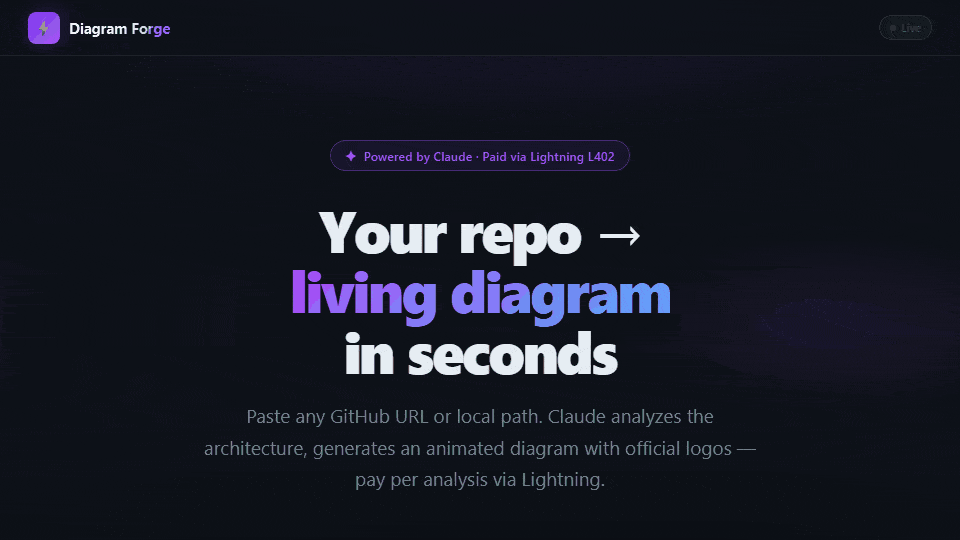
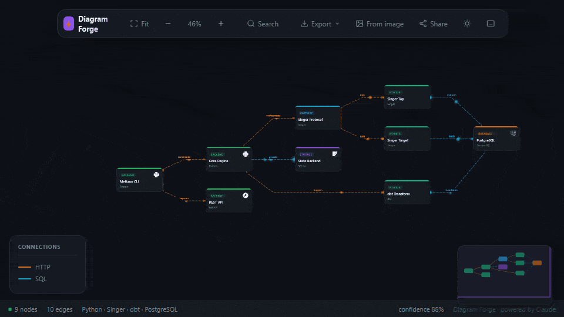
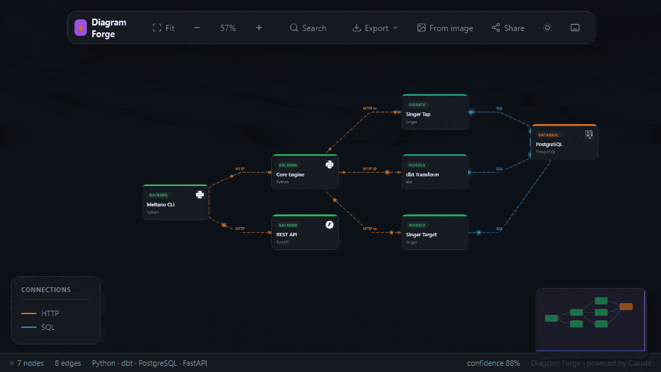
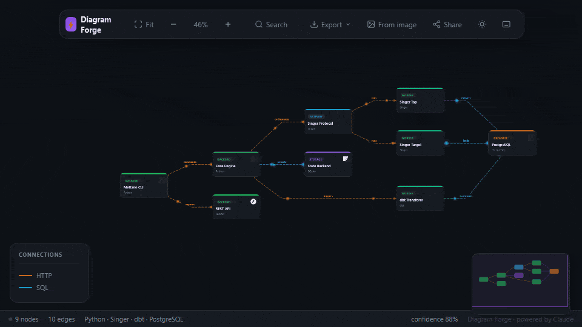

# ⚡ Diagram Forge

> **Your repo → living architecture diagram in seconds.**  
> Powered by Claude AI · Paid via Lightning L402 · No sign-up required.

<p align="center">
  
</p>

<p align="center">
  <a href="https://github.com/ThiagoDataEngineer/diagram-forge/blob/main/LICENSE"></a>
  
  
  
  
</p>

---

## What it does

Diagram Forge points at any GitHub repository (or local path, or an image of a whiteboard) and returns a **living, interactive architecture diagram** — complete with animated data-flow particles, node inspection, benchmarking, and exports to every format you need.

No account. No monthly subscription. Pay per analysis with a Lightning wallet.

---

## Demo

### Analyze a GitHub repo

<p align="center">
  
</p>

### Interactive viewer — pan, zoom, inspect, export

<p align="center">
  
</p>

### Import from an image (whiteboard, screenshot, Visio, PDF)

<p align="center">
  
</p>

### Benchmark your architecture

<p align="center">
  
</p>

---

## Features

| | |
|---|---|
| **Agentic Analysis** | Claude autonomously explores your repo — reads configs, traces imports, detects services, maps connections. Works with any stack. |
| **Living Diagrams** | Animated particle flow per protocol (HTTP blue, SQL green, gRPC orange…). Pan, zoom, drag. |
| **80+ Official Logos** | React, PostgreSQL, Redis, Kafka, Terraform… all rendered from Simple Icons with brand colors. |
| **Node Inspector** | Click any service: IN/OUT flows, criticality badge, 2nd-degree neighbors, "Explain deeper" (AI). |
| **Architecture Diff** | Compare two snapshots — added/removed services highlighted in green/red, pattern drift report. |
| **Benchmark** | Score on 6 AWS Well-Architected dimensions: Resilience, Observability, Security, Scalability, Simplicity, Async Coverage. Evidence-based. |
| **Image Import** | Upload a whiteboard photo, screenshot, or PDF — Claude Vision extracts the graph. |
| **Export Everything** | SVG · PNG · JSON · Markdown · draw.io · Excalidraw |
| **Record** | Built-in screen recorder → WebM → GIF for your README. |
| **MCP Integration** | Use Diagram Forge as a tool inside Claude Desktop, Cursor, or any MCP-compatible AI. |
| **Pay Per Use** | No subscription. 2,000 sats for a quick scan, 10,000 sats for a full repo. |

---

## Pricing

> Pay once per analysis. No recurring charges. No account.

| Tier | Price | What you get |
|------|-------|-------------|
| **Basic** | 2,000 sats (~$2) | Quick scan — up to 10 key files, main services detected |
| **Full** | 10,000 sats (~$10) | Complete repo analysis — all services, connections, monorepos, notebooks |
| **Live** | 25,000 sats (~$25) | Full analysis + animated SVG export with official logos |

Payment via **Lightning Network** (L402 protocol). Any wallet: Alby, Phoenix, Wallet of Satoshi, Muun.

---

## Quick Start

### Use online

```
https://forge.l402kit.com
```

### Run locally

```bash
git clone https://github.com/ThiagoDataEngineer/diagram-forge
cd diagram-forge
npm install

# Add your Anthropic API key
echo "ANTHROPIC_API_KEY=sk-ant-..." >> .env

npm run dev
# → http://localhost:3000
```

### MCP (Claude Desktop / Cursor)

Add to your `mcp.json`:

```json
{
  "mcpServers": {
    "diagram-forge": {
      "command": "npx",
      "args": ["tsx", "/path/to/diagram-forge/src/mcp/server.ts"]
    }
  }
}
```

Then ask Claude: *"Analyze the architecture of my project at ~/my-repo"*

---

## Supported Stacks

<p>
  TypeScript · JavaScript · Python · Java · Scala · Go · Rust · Ruby · 
  Jupyter · Databricks · Spark · dbt · Airflow · 
  Terraform · Docker Compose · Kubernetes · Helm · 
  React Native · Flutter · iOS · Android ·
  Monorepos (Turborepo, Nx, Lerna)
</p>

---

## Export Formats

<table>
<tr>
<td><b>SVG</b><br/>Animated, scalable. Perfect for presentations.</td>
<td><b>PNG</b><br/>Static snapshot. Drop into any doc.</td>
</tr>
<tr>
<td><b>draw.io</b><br/>Open in diagrams.net for manual editing.</td>
<td><b>Excalidraw</b><br/>Hand-drawn style. Great for sketches.</td>
</tr>
<tr>
<td><b>Markdown</b><br/>Full report: Mermaid diagram + risk analysis + tech stack breakdown.</td>
<td><b>JSON</b><br/>Raw graph data. Feed into CI/CD pipelines.</td>
</tr>
</table>

---

## How It Works

```
GitHub URL / local path / image
        │
        ▼
   Claude (Haiku)
   agentic loop ──► list_directory
                ──► read_file
                ──► search_pattern
                ──► detect_entry_points
                ──► finish_analysis
        │
        ▼
  ArchitectureGraph
  { nodes, edges, summary, confidence }
        │
        ▼
  Interactive Viewer
  (particles · logos · inspector · exports)
```

Payment is verified via **L402** before the analysis runs — the server issues a Lightning invoice, the client pays, sends the preimage back, and the analysis proceeds. No accounts, no cookies, no tracking.

---

## Architecture Diff in CI/CD

```bash
# Save current architecture snapshot
curl http://your-server/analyze \
  -H "Authorization: L402 <macaroon>:<preimage>" \
  -d '{"repo_url":"https://github.com/you/repo"}' \
  | jq .graph > graphs/v2.json

# Compare
curl "http://your-server/api/diff?a=v1.json&b=v2.json&format=markdown"
```

---

## Environment Variables

| Variable | Required | Description |
|----------|----------|-------------|
| `ANTHROPIC_API_KEY` | ✅ | Claude API key |
| `LNBITS_URL` | Production | LNbits instance URL. Omit to use mock backend (dev). |
| `LNBITS_API_KEY` | Production | LNbits invoice API key |
| `MACAROON_SECRET` | Production | 32-byte hex secret for L402 token signing |
| `PORT` | No | Server port (default 3000) |
| `CLAUDE_MODEL` | No | Override Claude model (default: claude-haiku-4-5-20251001) |

---

## License

MIT · Built by ShinyDapps

---

> *"The best architecture documentation is the one that writes itself."*

> To record the demo GIFs above: open the viewer, click the **⏺ Record** button in the toolbar, perform the action, stop recording, convert the WebM to GIF with `ffmpeg -i demo.webm demo.gif`.
